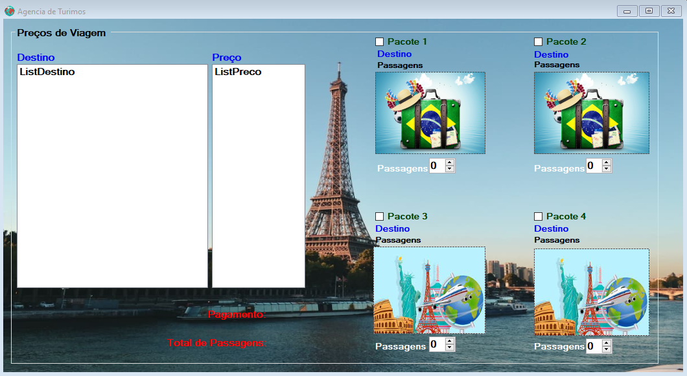
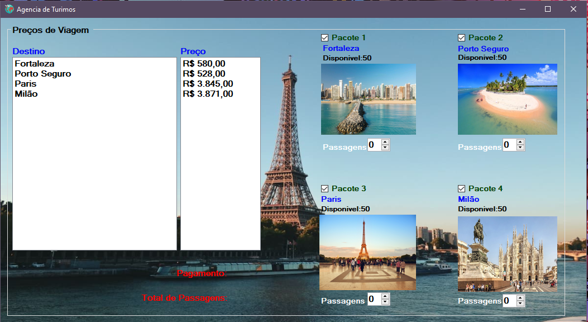

# Tourism_system 📚🕓

 Esse sistema foi criado para compras de passagens de vigem, usando C# como linguagem de alto nivel e .Net FRAMEWORK

◽ O sistema soma o valor das passagens com a quantidade de passagens que o cliente gostaria de estar comprando. Além disso mostra também a quantidade em estoque e conforme for aumentando o número de passagens compradas, vai diminuindo o número em estoque(como padrão o estoque tem o máximo de 50). mas para que aconteça esse processo é necessario que a checkbox esteja marcada.

<h3>1° Tela de inicialização 📸<h3>

<h3>2° Tela com os componentes(checkbox)selecionados 📸<h3>

<h3>3° Video de apresentação 🎥<h3>
